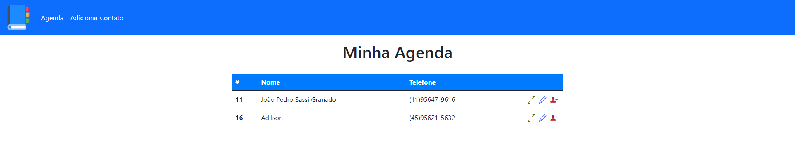

# PJ - Agenda
 Este projeto é um sistema de Agenda. O objeto de estudo aqui é a conexão com BD + partícularidades do PHP e a WEB, como sessions, variáveis globais e outras coisas. Este projeto se trata da seção 17 do curso PHP: Do zero a Maestria

 ## Como está o projeto?
O projeto conta com uma home pra visualização de contatos, uma tela para adicionar contatos, uma tela para editar as informações de contatos e uma de visualização completa de um contato em específico, formando assim o **Crud** completo

### Capturas de tela
Home:


Edit:


Create:


## Rodar o projeto
Caso queira rodar o projeto em sua máquina local será necessário o Apache e o Banco de Dados Mysql. Recomendo a instalação do **Laragon**, que é um pacote de instalaçaões que traz esses 2 serviços. Basta jogar o projeto na pasta *www* e colocar o banco de dados base disponível na pasta Database no servidor local (Pode-se fazer isso pelo PHPMyadmin). OBS: Talvez seja necessário mudar o arquivo connect.php deixando a variável password vazia.

```php
   $pass = "";
```

 ## Stack
 As tecnologias usadas nesse projeto são:
 * HTML
 * CSS
 * PHP
 * Bootstrap
 
 Acesse o repositório do curso citado clicando [Aqui](https://github.com/JoaopedroSassi/PHP_Zero_Maestria-HC)
